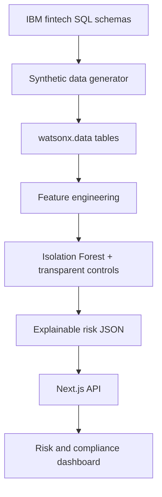

# Member 1 Architecture and Handoff

## Boundary with other members

- **Member 1:** Owns everything inside `data-science/`, including the output contract.
- **Member 2:** Reads `scored_transactions.json` or queries the equivalent watsonx.data table and exposes it through the API.
- **Member 3:** Uses the schema in `schemas/risk-score.schema.json` for tables, charts, filtering, and alert details.

## TechZone demonstration sequence

1. Show that source data is synthetic and follows the fintech SQL relationships.
2. Show the three source datasets in watsonx.data.
3. Run or explain feature engineering and anomaly scoring.
4. Query high/critical alerts through watsonx.data.
5. Open the dashboard and trace one alert back to its reasons and recommended action.
6. Explain that analysts make the final decision.

## Integration acceptance criteria

- API returns an array of objects valid against `risk-score.schema.json`.
- Dashboard renders all four severity values.
- Every high or critical alert displays at least one explanation.
- No real customer data, credential, or secret is committed.
- A local fallback demonstration works without IBM credentials.
